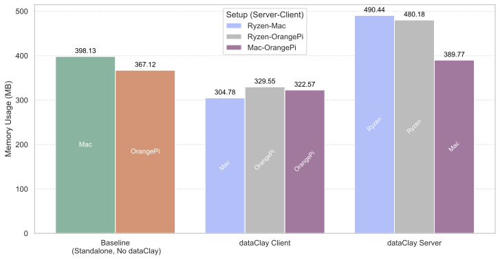
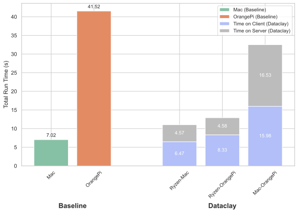

[](LICENSE)

# Distributed AI Workload Management via Active Storage and dataClay

## Overview

This repository demonstrates how to offload artificial intelligence (AI) workloads across distributed systems using active storage architectures. It leverages **dataClay** and **Docker** to orchestrate and manage model training across a client-server infrastructure.


The dataset used in this repository is publicly available on Hugging Face:

- [Live CPU Utilization Dataset](https://huggingface.co/datasets/ICOS-AI/live_cpu_utilization)

---

## 📊 Results




**Runtimes:**




## 📦 Project Structure

### 🔧 Server-Side Training with dataClay

To train a model on the server using dataClay:

1. Open `train_dataclay.py` and set the correct `server_ip`.

2. Ensure Docker Compose is up and running:

```bash
docker-compose up -d
```

3. Define two experiment names:
   - `client_experiment` for storing client results.
   - `experiment_name` for storing server results.

4. Run the training notebook:

```bash
./AIoffload/0_server_experiment.ipynb
```

---

### 🧪 Baseline (Non-dataClay) Training

For standalone (non-dataClay) experiments:

1. Open the notebook:

```bash
./Baseline/1_client_experiment.ipynb
```

2. Set `experiment_name` to track and store metrics and results.

---

## ⚙️ Environment Setup Instructions

You'll need to configure both the server and client environments.

### 🖥️ Server Setup

1. Install Miniconda:

- For Linux:
  ```bash
  wget https://repo.anaconda.com/miniconda/Miniconda3-latest-Linux-x86_64.sh
  bash Miniconda3-latest-Linux-x86_64.sh
  ```

- For macOS:
  ```bash
  curl -O https://repo.anaconda.com/miniconda/Miniconda3-latest-MacOSX-x86_64.sh
  bash Miniconda3-latest-MacOSX-x86_64.sh
  ```

2. Initialize Conda:

```bash
source ~/miniconda3/bin/activate
conda init
```

Then restart your terminal.

3. Create and activate the server environment:

```bash
conda create -n server_env python=3.10.16 -y
conda activate server_env
```

4. Clone the repository and install dependencies:

```bash
git clone <repository_url>
cd <repository_directory>
pip install -r requirements.txt
```

> Make sure `torch` is included (add a specific CUDA version if needed).

5. Start Docker + dataClay:

```bash
docker-compose down
docker-compose up -d
```

---

### 💻 Client Setup

1. Install Miniconda (same steps as server).

2. Create and activate the client environment:

```bash
conda create -n client_env python=3.10.16 -y
conda activate client_env
```

3. Clone the repository and install dependencies:

```bash
git clone <repository_url>
cd <repository_directory>
pip install -r requirements-client.txt
```

⚠️ Do **not** include `torch` in client requirements if unnecessary.

4. Install Jupyter Notebook:

```bash
conda install -c conda-forge notebook
```

5. Launch Jupyter:

```bash
jupyter-notebook
```

---

## 🏅 Funding

🇪🇺 This work has received funding from the European Union’s HORIZON research and innovation programme under grant agreement No. 101070177.

